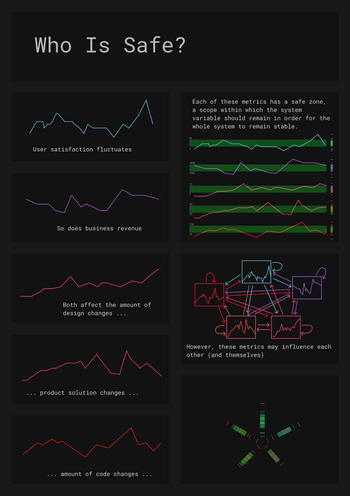
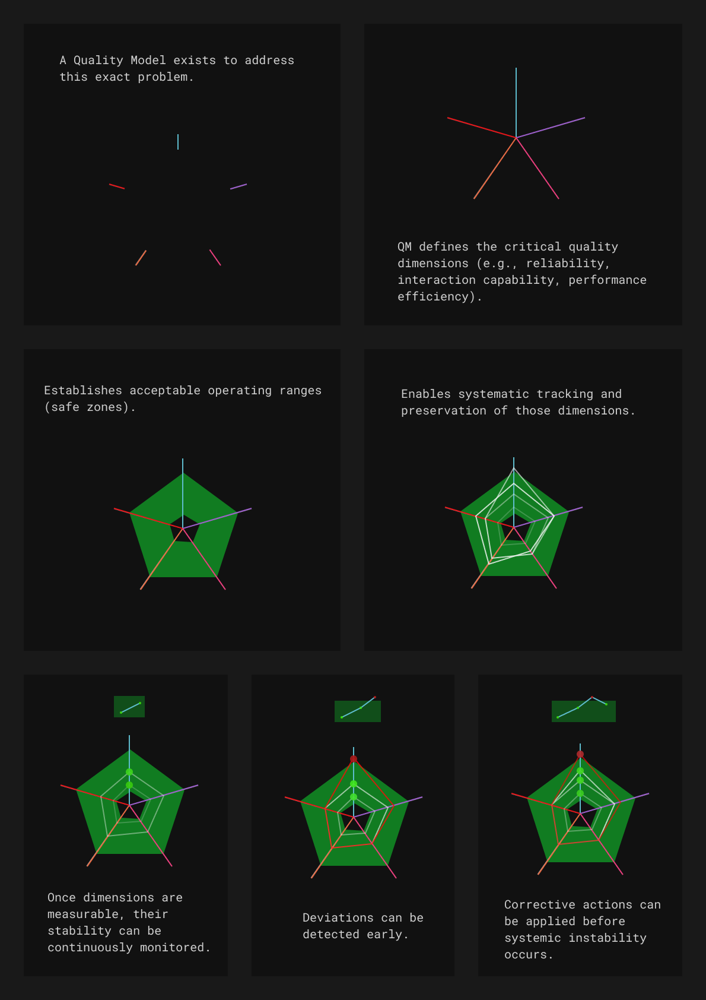
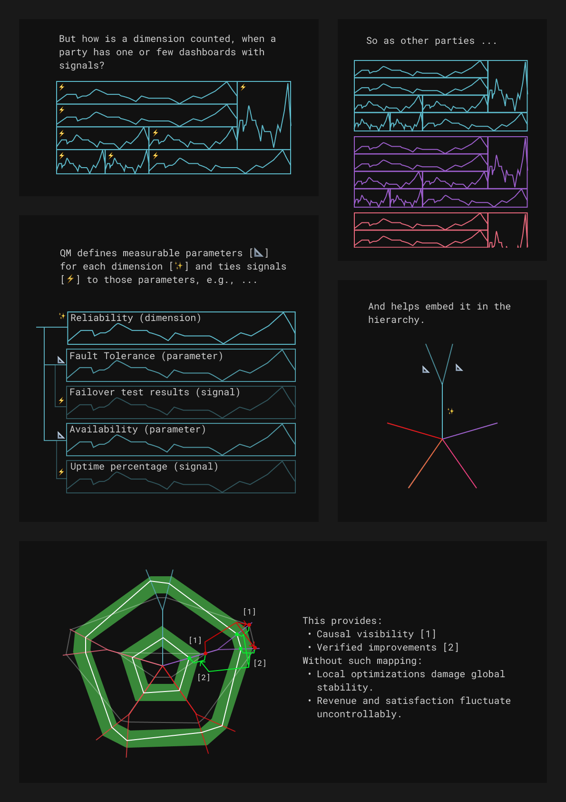

### How can quality understanding be shared and aligned across different parties and production stages?
This is a repository for the Quality Model via Quality Model Diagram.
Full RFC is available [here](./docs/qmdocs/Index%20RFC.md).

This is the brief onboarding.

And the idea behind it.

