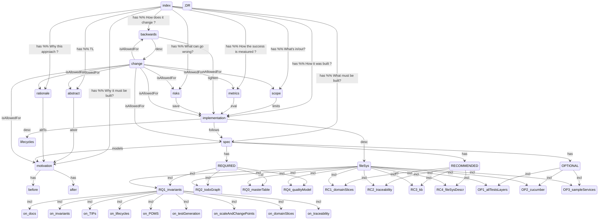

_read the mermaid diagram description_

```mermaid

	stateDiagram-v2
	
		%% This diagram defines the framework’s ontology and governing relationships.
		%% It is intended to be shared and interpreted consistently by both humans and tools.
		%% Any change to elements or relationships in this graph MUST comply with the
		%% Backwards Compatibility rules defined in the corresponding section.
		%% NOTE: This is a conceptual dependency and governance graph,
		%% not a runtime or behavioral state machine.

	    
	    %% Relationship Semantics (Arrow Dictionary) ----------------------------
	
	    %%	| Arrow Label           | Meaning                |
	    %%  | --------------------- | ---------------------- |
	    %%  | `has`                 | Structural containment |
	    %%  | `incl`                | Includes conceptually  |
	    %%  | `desc`                | Describes              |
	    %%  | `models`              | Abstracts into         |
	    %%  | `follows`             | Must conform to        |
	    %%  | `limits`              | Constrains             |
	    %%  | `eval`                | Evaluates              |
	    %%  | `tighten`             | Narrows                |
	    %%  | `save`                | Mitigates              |
	    %%  | `abstr`               | Summarizes             |
	    %%  | `altTo`               | Competes with          |
	    %%  | `isAllowedFor`        | Action is allowed      |
	
	
	    %% Include elements to the index ----------------------------------------
	    
	    %% Index is knowledge base key document and includes core tool related data. 
	    index --> abstract: has %% TL;DR
	    index --> motivation: has %% Why it must be built?
	    index --> spec: has %% What must be built?
	    index --> rationale: has %% Why this approach ?
	    index --> backwards: has %% How does it change ?
	    index --> risks: has %% What can go wrong?
	    index --> scope: has %% What's in/out?
	    index --> implementation: has %% How it was built ?
	    index --> metrics: has %% How the success is measured ?
	
	    %% Describe index elements relations ------------------------------------
	    
	    abstract --> motivation: abstr
	    rationale --> motivation: altTo
	    spec --> motivation: models
	    implementation --> spec: follows
	    scope --> implementation: limits
	    metrics --> implementation: eval
	    backwards --> implementation: tighten
	    risks --> implementation: save
	
	    %% Unfold Motivation ----------------------------------------------------
	    
	    motivation --> before: has
	    motivation --> after: has
	
	    %% Unfold Spec ----------------------------------------------------------
	    
	    spec --> REQUIRED: has
	    spec --> RECOMMENDED: has
	    spec --> OPTIONAL: has
	    REQUIRED --> RQ1_invariants: incl
	    REQUIRED --> RQ2_todoGraph: incl
	    REQUIRED --> RQ3_masterTable: incl
	    REQUIRED --> RQ4_qualityModel: incl
	    RECOMMENDED --> RC1_domainSlices: incl
	    RECOMMENDED --> RC2_traceability: incl
	    RECOMMENDED --> RC3_kb: incl
	    RECOMMENDED --> RC4_fileSysDescr: incl
	    OPTIONAL --> OP1_allTestsLayers: incl
	    OPTIONAL --> OP2_cucumber: incl
	    OPTIONAL --> OP3_sampleServices: incl
	
	    %% Unfold Backwards Compatibility ---------------------------------------
	    
	    backwards --> change: desc
	    change --> abstract: isAllowedFor
	    change --> motivation: isAllowedFor
	    change --> spec: isAllowedFor
	    change --> rationale: isAllowedFor
	    change --> implementation: isAllowedFor
	    change --> backwards: isAllowedFor
	    change --> scope: isAllowedFor
	    change --> risks: isAllowedFor
	    change --> metrics: isAllowedFor
	
	    %% Unfold Bacwards Implementation ---------------------------------------
	    
	    implementation --> fileSys: desc
	    implementation --> lifecycles: desc
	    fileSys --> RQ1_invariants :incl
	    fileSys --> RQ2_todoGraph :incl
	    fileSys --> RQ3_masterTable :incl
	    fileSys --> RQ4_qualityModel :incl
	    fileSys --> RC1_domainSlices :incl
	    fileSys --> RC2_traceability :incl
	    fileSys --> RC3_kb :incl
	    fileSys --> RC4_fileSysDescr :incl
	    fileSys --> OP1_allTestsLayers: incl
	    fileSys --> OP2_cucumber: incl
	    fileSys --> OP3_sampleServices: incl
	
	    %% Unfold RQ1 for invariants --------------------------------------------
		
	    RQ1_invariants --> on_docs :incl
	    RQ1_invariants --> on_invariants :incl
	    RQ1_invariants --> on_TIPs :incl
	    RQ1_invariants --> on_lifecycles :incl
	    RQ1_invariants --> on_POMS :incl
	    RQ1_invariants --> on_testGeneration :incl
	    RQ1_invariants --> on_scaleAndChangePoints :incl
	    RQ1_invariants --> on_domainSlices :incl
	    RQ1_invariants --> on_traceability :incl
	    
```
